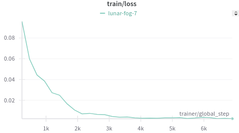
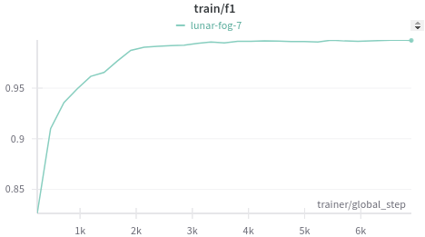
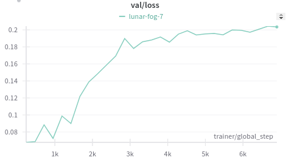
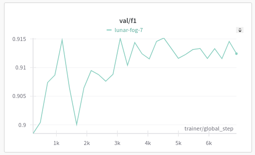
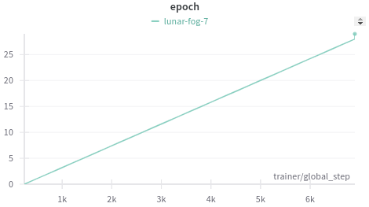
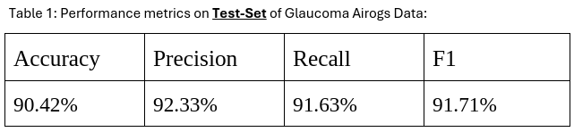

### Acknowledgement
We would like to thank [Lightning-Hydra-Template](https://github.com/ashleve/lightning-hydra-template) for providing a modifiable framework for running multiple experiments while tracking the hyperparameters.

pip install -r requirements.txt

Data available at: https://zenodo.org/records/5793241

Run data_preprocessing/separate_out_data.py, data_preprocessing/separate_train_test_val.py, data_preprocessing/crop_transform_pad_img.py  python scripts to preprocess the data

Run : 
python src/train.py experiment=glaucoma_eyepacs_airogs 

Used focal loss, only trained on 7k non-glaucomic train images, remaining glaucoma train images

Training : 

Validation : 

Training upto 29 epoch, using early stopping patience : 10

Test Results : 
